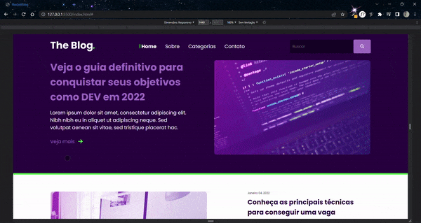

<h1 align="center">
    Rocket Blog
</h1>

<div align="center">
   <a href="https://github.com/JohnPetros">
      
   </a>
   
   <a href="https://github.com/JohnPetros/rocketblog/commits/main">
      
   </a>
  </a>
   </a>
   <a href="https://github.com/JohnPetros/rocketblog/blob/main/LICENSE.md">
      
   </a>
    
</div>

<br>

## 🖥️ Projeto

Homepage responsiva para um blog de notícias voltado para devs feito com HTML e CSS. Projeto desenvolvido como desafio durante o Discover, que é um programa promovido pela **@Rocketseat** voltado para o ensino de programação web para iniciantes.

### Demonstração
<div align="center">
    
</div>

---


## 📖 Aprendizado

- Criação de um menu lateral puramente com CSS e HTML, que funciona da seguinte forma: quando a largura da pagína diminui a uma certa medida, aparece um menu hambúrguer no cabeçalho, que nada mais é que uma label associada a um checkbox escondido. Quando essa checkbox é preenchida, o menu lateral é deslocado para a direita via CSS de modo que apareça na parte esquerda da página. 

---

## 🛠️ Tecnologias

Esse projeto foi desenvolvido com as seguintes tecnologias:

✔️ **[CSS](https://developer.mozilla.org/pt-BR/docs/Web/CSS)**

✔️ **[HTML](https://developer.mozilla.org/pt-BR/docs/Web/HTML)**


## 🚀 Como rodar este projeto

### Pré-requesitos

Embora não seja obrigatório, para rodar a aplicação de uma forma mais prática, é bom ter o editor de código [VSCode](https://code.visualstudio.com/) junto com a extensão [Live Server](https://marketplace.visualstudio.com/items?itemName=ritwickdey.LiveServer), que pode ser instalada no marketplace do próprio VSCode. 

#### 📟 Rodando a aplicação

```bash

# Clone este repositório no terminal/cmd
$ git clone https://github.com/JohnPetros/rocketshoes.git

# Acesse a pasta do projeto 
$ cd rocketshoes

# Abra a pasta no VSCode
$ code .

# Execute o arquivo index com a extensão Live Server, clicando com o botão direito sobre ele e depois em Open with Live Server

```

## 🎨 Layout:
No link abaixo você encontra o layout do projeto feito pela equipe da Rocketseat. Lembrando que você precisa ter uma conta no [Figma](http://figma.com/) para acessá-lo.

- [Layout](https://www.figma.com/file/glgyL2Vz8hZ1HsjzvcOx8T/DD-%2F-RocketBlog-(Copy)?node-id=3%3A2&t=cXVyNYSIc4dm9Py8-0)

---

## :memo: Licença

Esse projeto está sob a licença MIT. Veja o arquivo [LICENSE](LICENSE) para mais detalhes.

---

Feito com 💜 by João Pedro 👋🏻